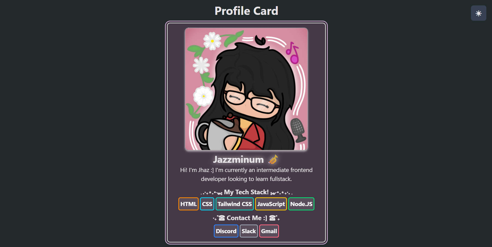
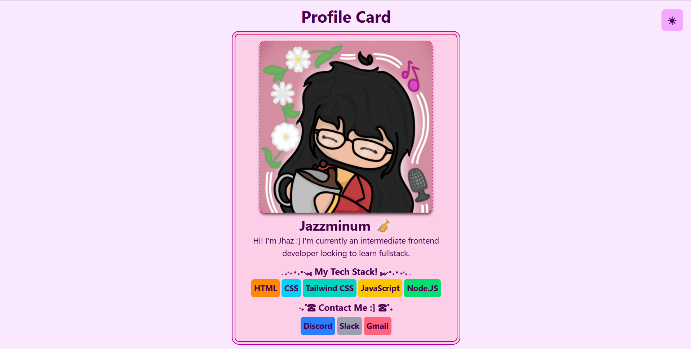
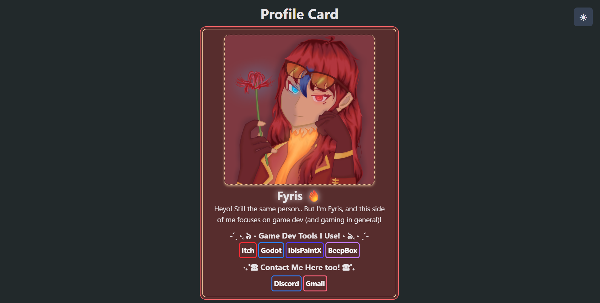
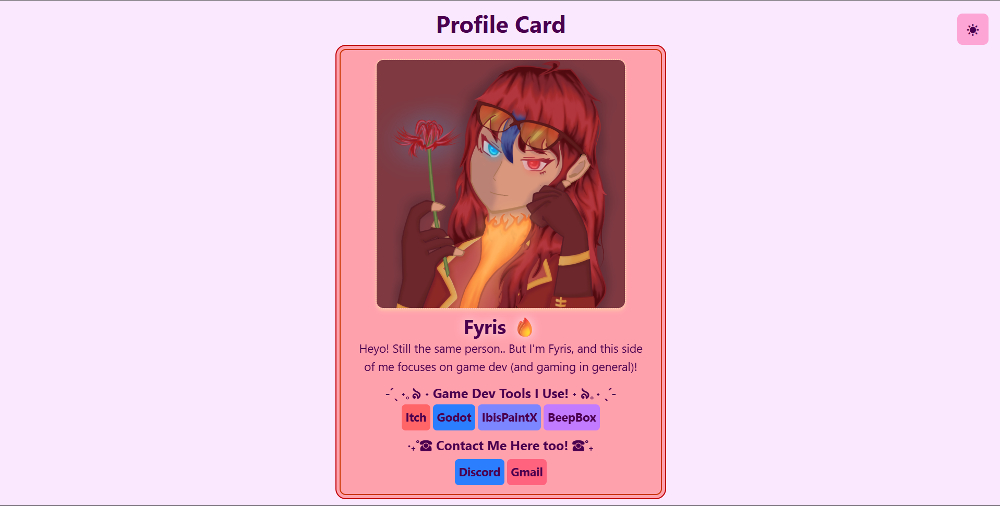

# ProfileCard-Tailwind
A simple site inspired by tools like Strawpage and Carrd.co; built with HTML, Tailwind CSS, and JavaScript. Solely developed by Jhazmine Audrey Perez.

## Features
This site includes the following features:
- A flip animation to showcase both cards on the site.
- A dark mode button that allows users to smoothly toggle between light and dark mode.
- Responsive design that allows the site to be run and used on most devices.

## Tech Stack
- HTML
- CSS / Tailwind CSS
- JavaScript

## How to Run
1. Simply go to https://jhazmineaudrey.github.io/ProfileCard-Tailwind/, no need to install anything on your device.
2. Feel free to quickly mess around with the site and view its contents.

## Screenshots

